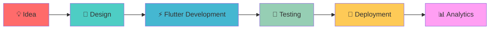
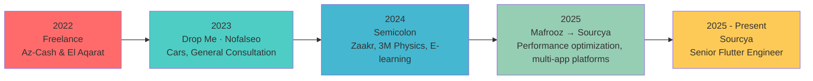
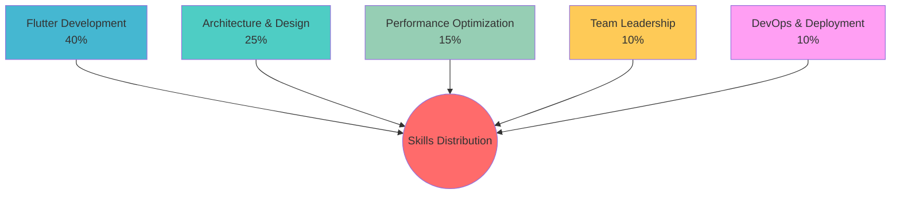
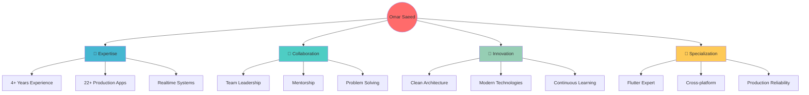

  <h1>
    👋 Omar Saeed - Senior Flutter Engineer
  </h1>
  <!--  -->

---

## 🚀 About Me

> 💻 **Senior Flutter Engineer** from Egypt with **4+ years** of experience building production-level mobile and web applications. Currently at **Sourcya** and **open to select senior opportunities**.

- 🎯 **Expertise**: Cross-platform mobile apps (Android, iOS, Web)
- 📱 **Specialization**: High-performance apps with clean architecture
- � **Education**: B.Sc. Commerce (English Section) - Menoufia University (2019-2023)
- 👨‍🏫 **Mentorship**: Mentored junior developers on Flutter clean architecture and code-review practices
- 📦 **Output**: **22+ production apps** across various platforms

> 📌 Check out my pinned repositories below for code samples!

---

## 🎯 Technical Skills

### 📱 **Mobile Development**

Flutter/Dart · GetX · BLoC/Cubit · Provider · Clean Architecture · Realtime (WebSocket/Pusher) · CI/CD (Fastlane/Codemagic/GitHub Actions)

<strong>🔧 Core Technologies</strong>

| Technology | Experience |
|------------|------------|
| **Flutter** | 4+ years |
| **Dart** | 4+ years |
| **BLoC/Cubit** | 2+ years |
| **GetX** | 4+ years |
| **Provider** | 1+ years |
| **Firebase** | 2+ years |

### 🛠️ **Tech Stack**

#### **Languages & Frameworks**

#### **State Management**

#### **Backend & Services**

#### **Tools & Platforms**

#### **Navigation**

#### **Persistence**

#### **Testing**

#### **CI/CD**

#### 🏗️ **Architecture & Codegen**

#### 📱 **Native & Performance**

#### 🎨 **Design Systems**

#### 💼 **PM & Productivity**

#### 🤖 **AI & MCP**

#### ☁️ **Infra & Observability**

---

## 👔 Professional Experience

### 🏢 **Current Positions**

<table>
<tr>
<td width="50%">

#### 🚀 **Sourcya Company**
**Senior Flutter Engineer** _(Sep 2025 - Present)_
- Multi-app delivery & workforce platform development
- GPS tracking, ride-hailing, and logistics apps
- Cross-platform (Android, iOS, Web)

</td>
<td width="50%">

#### ♻️ **Drop Me Company** 
**Lead Flutter Developer (Part-time)** _(Jan 2023 - Present)_
- Community-driven recycling platform
- Real-time rewards system
- Sustainable practices gamification
- Ongoing part-time alongside full-time roles

</td>
</tr>
</table>

---

## 📚 Featured Projects

### 🏆 **Production Apps**

| App | Platform |
|-----|----------|
| **TMT Track** |    |
| **Drop Me** |   |
| **Nasni** |    |
| **Kold** |    |
| **Arbeta** |   |
| **Ammena** |   |
| **Mafrooz** |  |
| **Rehla** |       |
| **Madaan** |   |
| **Rehla Ride** |   |
| **Maydan** |  |
> 💡 **Additional Apps**: PlayX Ecosystem, Az-Cash, El Aqarat, Zaakr, 3M Physics, Super School, E-learning, Cars, General Consultation — bringing the total to **22+ production apps** across various platforms.

<strong>🔍 Project Details</strong>

### 📍 **TMT Track**
> Real-time GPS tracking platform
- **Features**: Live tracking, fleet management, geofencing
- **Platforms**: Android, iOS, Web
- **Links**: [Google Play](https://play.google.com/store/apps/details?id=com.altatawwar.tmt.track.app) · [App Store](https://apps.apple.com/ms/app/tmt-live-app/id6749963131) · [Web App](https://gps.tmtx.io/)

### 💧 **Nasni**
> Monitoring and tracking of assets or people inside buildings platform
- **Features**: Order management, delivery tracking, subscription plans
- **Platforms**: Android, iOS, Web
- **Links**: [Google Play](https://play.google.com/store/apps/details?id=com.altatawwar.nasni.app) · [App Store](https://apps.apple.com/eg/app/nasni/id6754703562) · [Web App](https://app.nasni.io/)

### ❄️ **Kold**
> Track temperature and humidity levels across warehouses, storage rooms, and sensitive inventory areas—all in real time platform
- **Features**: Temperature-controlled delivery, fleet management, order tracking
- **Platforms**: Android, iOS, Web
- **Links**: [Google Play](https://play.google.com/store/apps/details?id=com.altatawwar.kold.app) · [App Store](https://apps.apple.com/eg/app/kold/id6754703360) · [Web App](https://app.koldx.io/)

### 👷 **Arbeta**
> Workforce management platform
- **Features**: Worker matching, job assignments, attendance tracking
- **Platforms**: Android, iOS
- **Links**: [Google Play](https://play.google.com/store/apps/details?id=sa.com.altatawwar.arbeta.app) · [App Store](https://apps.apple.com/eg/app/arbeta-workforce/id6746787214)

### 🏥 **Ammena**
> Medical services platform
- **Features**: Appointment booking, medical service management, patient tracking
- **Platforms**: Android, Web
- **Links**: [Google Play](https://play.google.com/store/apps/details?id=io.sourcya.swnw.app) · [Web App](https://swnw.amenaa.com/)

### ♻️ **Mafrooz**
> Recycling services platform
- **Features**: Recycling management, pickup scheduling, waste tracking
- **Platforms**: Web
- **Links**: [Web App](https://hub.app.mfroz.com/)

### 🚌 **Rehla**
> Ride-hailing & transportation platform
- **Apps**: Operator, Driver, Passenger, Station
- **Features**: Multi-role architecture, real-time matching, route management
- **Links**: [Driver - Google Play](https://play.google.com/store/apps/details?id=sa.com.altatawwar.rehla.driver.app) · [Driver - App Store](https://apps.apple.com/eg/app/rehla-driver/id6759146405) · [Passenger - Google Play](https://play.google.com/store/apps/details?id=com.altatawwar.rehla.passenger.app) · [Operator - Web](https://rehla-operator-app.vercel.app/) · [Station - Web](https://rehla-station-app.vercel.app/)

---

### ♻️ **Drop Me**
> Community-driven bottle recycling initiative
- **Features**: Rewards system, community engagement, sustainability tracking
- **Platforms**: Android, iOS
- **Links**: [Google Play](https://play.google.com/store/apps/details?id=com.dropme.recycling) · [App Store](https://apps.apple.com/eg/app/drop-me-recycle-in-seconds/id6748382942)
- **Impact**: Promoting eco-friendly practices through gamification
- **Status**: Ongoing part-time

---

###  **General Consultation**
> B2B consulting platform connecting businesses with experts
- **GitHub**: [View Repository](https://github.com/OmarSaeed20/general-consultation)
- **Features**: Real-time consultations, multi-domain expertise
- **Domains**: Marketing, Finance, Strategy consulting

### 📦 **PlayX Ecosystem**
> Open-source Flutter package ecosystem
- **GitHub**: [View Organization](https://github.com/playx-flutter)
- **Packages**: playx_network (streaming/SSE, interceptors, path params), playx_core (extensions, mapper utils), playx_version_update
- **Type**: Open-source contribution

---

## 🏆 Key Achievements

| 🎯 Achievement | 📊 Impact | 🗓️ Timeline |
|----------------|-----------|-------------|
| **Performance Optimization** | Deferred non-critical Firebase init and precached first-route assets to cut cold start | 2023-2024 |
| **Team Leadership** | Mentored junior developers on clean architecture and code review | 2023-Present |
| **Localization Expert** | Arabic/English in all apps | 2022-Present |
| **Production Deployments** | 22+ production apps across platforms | 2022-Present |
| **Reusable Infrastructure** | Built `sourcya_in_app_rating` package (5+ apps), PlayX ecosystem enhancements, Staging/Production flavors | 2025-Present |

---

## 🎓 Education & Certifications

### 🏫 **Academic Background**
**B.Sc. in Commerce (English Section)**  
*Menoufia University, Egypt* | **2019 - 2023**

### 📜 **Professional Certifications**

<table>
<tr>
<td>

#### 🏗️ **Flutter MVVM with Clean Architecture**
- **Instructor**: Mina Farid
- **Duration**: 22 Hours
- **Date**: Dec 2022
- **Focus**: Advanced state management, BLoC, Repository pattern, TDD

</td>
<td>

#### 🔧 **Advanced Flutter Clean Architecture**
- **Instructor**: Usama Elgendy  
- **Duration**: 8 Hours
- **Date**: Oct 2022
- **Focus**: Domain-driven design, Dependency inversion

</td>
</tr>
<tr>
<td colspan="2">

#### 📱 **The Complete 2022 Flutter & Dart Development**
- **Instructor**: Abdullah Mansour | **Duration**: 42 Hours | **Date**: Feb 2022
- **Comprehensive Coverage**: Dart fundamentals, full-stack Flutter, responsive UI for Android/iOS/Web
- **Key Skills**: Clean code practices, testing strategies, scalable architecture, job market readiness

</td>
</tr>
</table>

---

## 📊 GitHub Analytics

<!-- 

 -->

---

## 🌐 Languages

| Language | Proficiency | Usage |
|----------|-------------|-------|
| 🇪🇬 **Arabic** | Native | Professional & Personal |
| 🇺🇸 **English** | Professional | Technical Documentation & Communication |

---

## 💼 Why Choose Omar?

### ✨ **Core Strengths**
- 🎯 **Proven Track Record**: 22+ production apps across multiple platforms
- ⚡ **Performance Expert**: Profile-first optimization — battery, cold start, background GPS tuning
- 👥 **Team Leadership**: Mentored junior developers on clean architecture and code review
- 🏗️ **Architecture Guru**: Clean Architecture and SOLID principles advocate
- 🌍 **Global Ready**: Multilingual apps with proper localization

---

## 📞 Let's Connect!

### 🤝 **Ready to collaborate? Let's build something amazing together!**

---

**⭐ Star this repository if you found it helpful!**

*Last updated: August 2026*

